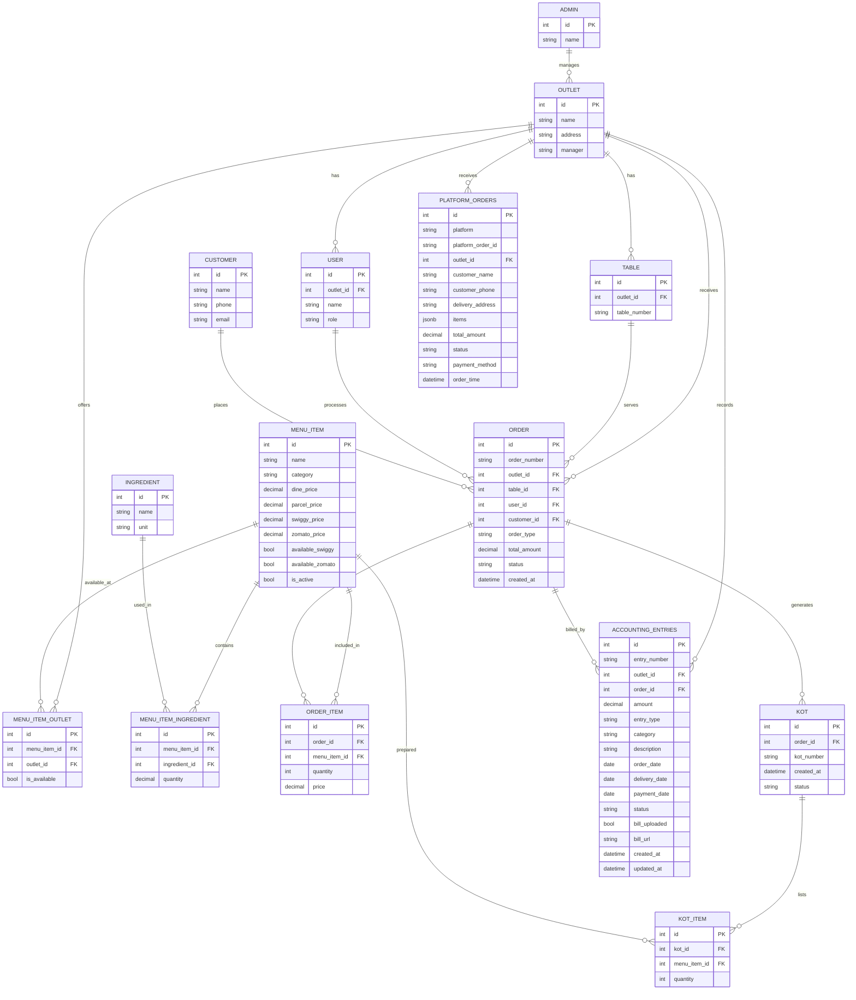

# Table Content Definitions

Below is a detailed list of all tables and the fields (columns) they contain, including example content for each table. This will help you understand what data each table holds in your restaurant management system.

---

## 1. ADMIN
| id | name         |
|----|--------------|
| 1  | Super Admin  |

---

## 2. OUTLET
| id | name           | address                                 | manager        | phone       | email                  | username      | password   | status   |
|----|----------------|-----------------------------------------|----------------|-------------|------------------------|--------------|------------|----------|
| 1  | Koregaon Park  | Shop 12, Lane 5, Koregaon Park, Pune    | Ramesh Gupta   | 9876543210  | kp@guptasandwich.in    | outlet_kp    | kp@1234    | active   |
| 2  | Baner          | Plot 8, Baner Road, Baner, Pune         | Suresh Sharma  | 9876543211  | baner@guptasandwich.in | outlet_baner | baner@1234 | active   |
| 3  | Kothrud        | Near Vanaz, Kothrud, Pune               | Dinesh Patil   | 9876543212  | kothrud@guptasandwich.in| outlet_kothrud| kothrud@1234| inactive |

---

## 3. USER (Outlet Staff)
| id  | outlet_id | name          | email                   | username    | password   | roleLabel | appRole | permissions                | status   |
|-----|-----------|---------------|-------------------------|-------------|------------|-----------|---------|----------------------------|----------|
| 101 | 1         | Ankit Sharma  | ankit@guptasandwich.in  | ankit_kp    | ankit@123  | Cashier   | Staff   | {pos, reports}             | active   |

---

## 4. MENU_ITEM (Dishes)
| id | name                  | category     | dine_price | parcel_price | swiggy_price | zomato_price | ingredients                        | outlets                  | is_active |
|----|-----------------------|-------------|--------------|-------------|-------------|-------------|-------------------------------------|--------------------------|-----------|
| 1  | Veg Club Sandwich     | Sandwiches  | 120          | 110         | 140         | 140         | Bread, Lettuce, Tomato, Mayo        | All                      | true      |
| 2  | Chicken Tikka Sub     | Subs        | 180          | 170         | 210         | 210         | Sub Roll, Chicken, Onion, Sauce     | Koregaon Park, Baner     | true      |
| 3  | Paneer Griller        | Sandwiches  | 150          | 140         | 175         | 175         | Bread, Paneer, Capsicum, Mayo       | All                      | true      |
| 4  | Cold Coffee           | Beverages   | 80           | 80          | 95          | 95          | Milk, Coffee, Sugar, Ice            | All                      | true      |
| 5  | Egg Bhurji Sandwich   | Sandwiches  | 130          | 120         | 150         | 150         | Bread, Egg, Onion, Spices           | Kothrud                  | true      |
| 6  | Masala Chai           | Beverages   | 40           | 40          | null        | null        | Tea, Milk, Ginger, Cardamom         | All                      | true      |

---

## 5. MENU_ITEM_OUTLET (Junction)
| id | menu_item_id | outlet_id | is_available |
|----|--------------|-----------|-------------|
| 1  | 1            | 1         | true        |
| 2  | 1            | 2         | true        |
| 3  | 1            | 3         | true        |
| 4  | 2            | 1         | true        |
| 5  | 2            | 2         | true        |
| 6  | 3            | 1         | true        |
| 7  | 3            | 2         | true        |
| 8  | 3            | 3         | true        |
| 9  | 4            | 1         | true        |
| 10 | 4            | 2         | true        |
| 11 | 4            | 3         | true        |
| 12 | 5            | 3         | true        |
| 13 | 6            | 1         | true        |
| 14 | 6            | 2         | true        |
| 15 | 6            | 3         | true        |

---

## 6. INGREDIENT
| id | name        | unit   |
|----|-------------|--------|
| 1  | Bread       | pcs    |
| 2  | Lettuce     | g      |
| 3  | Tomato      | g      |
| 4  | Mayo        | g      |
| 5  | Sub Roll    | pcs    |
| 6  | Chicken     | g      |
| 7  | Onion       | g      |
| 8  | Sauce       | g      |
| 9  | Paneer      | g      |
| 10 | Capsicum    | g      |
| 11 | Milk        | ml     |
| 12 | Coffee      | g      |
| 13 | Sugar       | g      |
| 14 | Ice         | g      |
| 15 | Egg         | pcs    |
| 16 | Spices      | g      |
| 17 | Tea         | g      |
| 18 | Ginger      | g      |
| 19 | Cardamom    | g      |

---

## 7. MENU_ITEM_INGREDIENT (Junction)
| id | menu_item_id | ingredient_id | quantity |
|----|--------------|--------------|----------|
| 1  | 1            | 1            | 2        |
| 2  | 1            | 2            | 20       |
| 3  | 1            | 3            | 30       |
| 4  | 1            | 4            | 15       |
| 5  | 2            | 5            | 1        |
| 6  | 2            | 6            | 50       |
| 7  | 2            | 7            | 20       |
| 8  | 2            | 8            | 10       |
| ...| ...          | ...          | ...      |

---

## 8. TABLES
| id | outlet_id | table_number | capacity | location      | is_active |
|----|-----------|-------------|----------|--------------|-----------|
| 1  | 1         | T1          | 4        | Ground Floor  | true      |
| 2  | 1         | T2          | 2        | Ground Floor  | true      |
| 3  | 2         | T1          | 4        | Main Hall     | true      |
| 4  | 3         | T1          | 6        | Balcony       | true      |

---

## 9. CUSTOMER
| id | name         | phone       | email                | favorite_dish         | total_visits | total_spent | last_visit_date |
|----|--------------|-------------|----------------------|-----------------------|--------------|-------------|----------------|
| 1  | Rahul Verma  | 9998887776  | rahul@email.com      | Veg Club Sandwich     | 5            | 1200        | 2026-05-10     |
| 2  | Priya Singh  | 8887776665  | priya@email.com      | Cold Coffee           | 3            | 400         | 2026-05-15     |

---

## 10. ORDER
| id | order_number | outlet_id | table_id | user_id | customer_id | total_amount | status   | created_at           |
|----|--------------|-----------|----------|---------|-------------|--------------|----------|---------------------|
| 1  | ORD001       | 1         | 1        | 101     | 1           | 350          | paid     | 2026-05-21 12:30:00 |
| 2  | ORD002       | 2         | 3        | 101     | 2           | 180          | unpaid   | 2026-05-21 13:00:00 |

---

## 11. ORDER_ITEM
| id | order_id | menu_item_id | quantity | price |
|----|----------|-------------|----------|-------|
| 1  | 1        | 1           | 2        | 120   |
| 2  | 1        | 4           | 1        | 80    |
| 3  | 2        | 2           | 1        | 180   |

---

This document provides a clear example of the content each table will contain in your system. You can expand or modify the sample data as per your requirements.

---

## Managing Dish Availability (Platform & Outlet)

### 1. Platform-Specific Availability (Swiggy/Zomato)
Each dish (MENU_ITEM) should have fields:
- `available_swiggy` (boolean)
- `available_zomato` (boolean)

**How it works:**
- If `available_swiggy` is `true`, the dish is shown on Swiggy; if `false`, it is hidden.
- If `available_zomato` is `true`, the dish is shown on Zomato; if `false`, it is hidden.

**Example:**
| id | name                | available_swiggy | available_zomato |
|----|---------------------|------------------|------------------|
| 1  | Veg Club Sandwich   | true             | false            |
| 2  | Chicken Tikka Sub   | false            | true             |

---

### 2. Outlet-Specific and Online-Only Availability

**Outlet Availability:**
- Use the `MENU_ITEM_OUTLET` table to control which outlets have a dish available.
- To make a dish unavailable in a specific outlet, set `is_available` to `false` for that outlet.

**Online-Only Dishes:**
- If you want a dish to be available only online (Swiggy/Zomato) and not in any physical outlet, set all `is_available` fields in `MENU_ITEM_OUTLET` to `false`, but keep `available_swiggy` or `available_zomato` as `true`.

**Outlet-Only Dishes:**
- If you want a dish to be available only in a specific outlet and not online, set `available_swiggy` and `available_zomato` to `false`, and set `is_available` to `true` for the desired outlet in `MENU_ITEM_OUTLET`.

---

### 3. Example Scenarios

- **Dish off for Zomato, on for Swiggy:**
	- Set `available_zomato = false`, `available_swiggy = true` for that dish.
- **Dish off in one outlet, available online:**
	- Set `is_available = false` for that outlet in `MENU_ITEM_OUTLET`, but keep `available_swiggy` or `available_zomato` as `true` in MENU_ITEM.
- **Dish only for online, not in any outlet:**
	- Set all `is_available = false` in `MENU_ITEM_OUTLET`, but keep `available_swiggy` or `available_zomato` as `true`.

This approach gives you full flexibility to control dish visibility per outlet and per online platform.

---

## Kitchen Order Ticket (KOT)

### What is KOT?
KOT (Kitchen Order Ticket) is a document or record generated for the kitchen, listing all items to be prepared for a particular order. It helps the kitchen staff know what to cook and for which table/order.

### KOT Table Structure
| id | order_id | kot_number | created_at           | status   |
|----|----------|------------|---------------------|----------|
| 1  | 1        | KOT001     | 2026-05-21 12:31:00 | open     |
| 2  | 2        | KOT002     | 2026-05-21 13:01:00 | closed   |

### KOT_ITEM Table (Optional, for item-level tracking)
| id | kot_id | menu_item_id | quantity |
|----|--------|-------------|----------|
| 1  | 1      | 1           | 2        |
| 2  | 1      | 4           | 1        |

### Relationships
- Each KOT is linked to an ORDER (order_id).
- Each KOT can have multiple KOT_ITEM records, each representing a dish and its quantity.
- KOT status can be `open`, `in-progress`, or `closed` to track kitchen workflow.

### Workflow
1. When an order is placed, a KOT is generated for the kitchen.
2. The KOT lists all dishes (and quantities) to be prepared.
3. Kitchen staff update the KOT status as items are prepared and served.
4. Once all items are served, the KOT is marked as `closed`.

This ensures smooth communication between the front-of-house (order taking) and kitchen staff, and provides a clear audit trail for each order's preparation.

---

## Accounting & Reports

### AccountingEntries Table
| id | entry_number | outlet_id | order_id | amount | entry_type | category | description | order_date | delivery_date | payment_date | status   | bill_uploaded | bill_url | created_at           | updated_at           |
|----|--------------|-----------|----------|--------|------------|----------|-------------|------------|--------------|-------------|----------|--------------|----------|---------------------|---------------------|
| 1  | TXN001       | 1         | 1        | 12400  | credit     | Sales    | ...         | 2025-05-12 | 2025-05-13   | 2025-05-13  | paid     | true         | ...      | 2025-05-13 10:00:00 | 2025-05-13 10:00:00 |

**Relationships:**
- Each accounting entry is linked to an outlet and (optionally) an order.
- Used for financial tracking, billing, and payment status.

### PlatformOrders Table
| id | platform | platform_order_id | outlet_id | customer_name | customer_phone | delivery_address | items | total_amount | status   | payment_method | order_time           |
|----|----------|------------------|-----------|---------------|---------------|------------------|-------|--------------|----------|---------------|---------------------|
| 1  | swiggy   | SWG123           | 1         | Rahul Verma   | 9998887776    | ...              | ...   | 420          | delivered| online        | 2026-05-21 12:00:00 |

**Relationships:**
- Each platform order is linked to an outlet.
- Used for tracking Swiggy/Zomato orders, delivery, and payment.

### Reports: Generation, Storage, and Display

Reports are not stored in a separate table. Instead, they are dynamically generated by querying and aggregating data from the following tables:
- `ORDER` and `ORDER_ITEM` (for sales, item-wise, and hourly reports)
- `ACCOUNTING_ENTRIES` (for financial, billing, and payment reports)
- `PLATFORM_ORDERS` (for Swiggy/Zomato and online sales reports)

#### How Reports Are Filtered and Displayed
- **Outlet Association:**
	- Every `ORDER`, `ACCOUNTING_ENTRIES`, and `PLATFORM_ORDERS` record has an `outlet_id` field.
	- This allows filtering all reports by outlet.
- **Admin View:**
	- Admin can view consolidated reports across all outlets or filter by a specific outlet using the `outlet_id` field.
	- Example: To see sales for "Baner" outlet, filter all queries with `outlet_id` matching Baner's ID.
- **Outlet Manager/Staff View:**
	- Outlet users only see data for their own outlet (filtered by their `outlet_id`).
- **Report Types:**
	- Daily sales, payment mode, GST, category-wise, hourly, platform breakdown, food cost, etc., are all generated by running SQL queries or aggregations on the above tables, grouped and filtered by `outlet_id` as needed.

#### Example: Generating a Sales Report for an Outlet
To generate a daily sales report for outlet "Koregaon Park":
1. Query the `ORDER` table for all orders with `outlet_id` matching Koregaon Park's ID and group by date.
2. Sum the `total_amount` field for each day.
3. Join with `ORDER_ITEM` for item-wise breakdown, or with `PLATFORM_ORDERS` for online sales.

#### Example: Admin Viewing All Outlets
Admin can run the same queries without filtering by `outlet_id` to see consolidated data, or group by `outlet_id` to compare outlets.

#### Summary
- Reports are always up-to-date, generated on demand from transactional tables.
- Outlet association is always available via the `outlet_id` field in all relevant tables.
- No need for a separate reports table unless you want to cache or archive historical reports.

---

## ER Diagram (Including Accounting & Reports)

---

This ER diagram and documentation now includes all tables needed for orders, KOT, accounting, platform orders, and reporting. Reports are generated by querying and aggregating data from these tables.