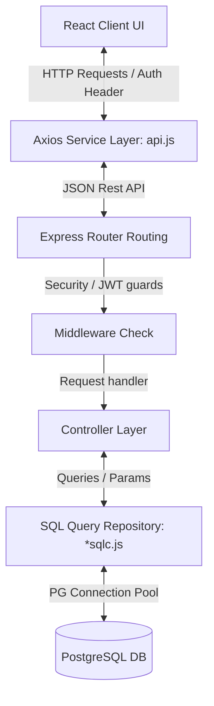
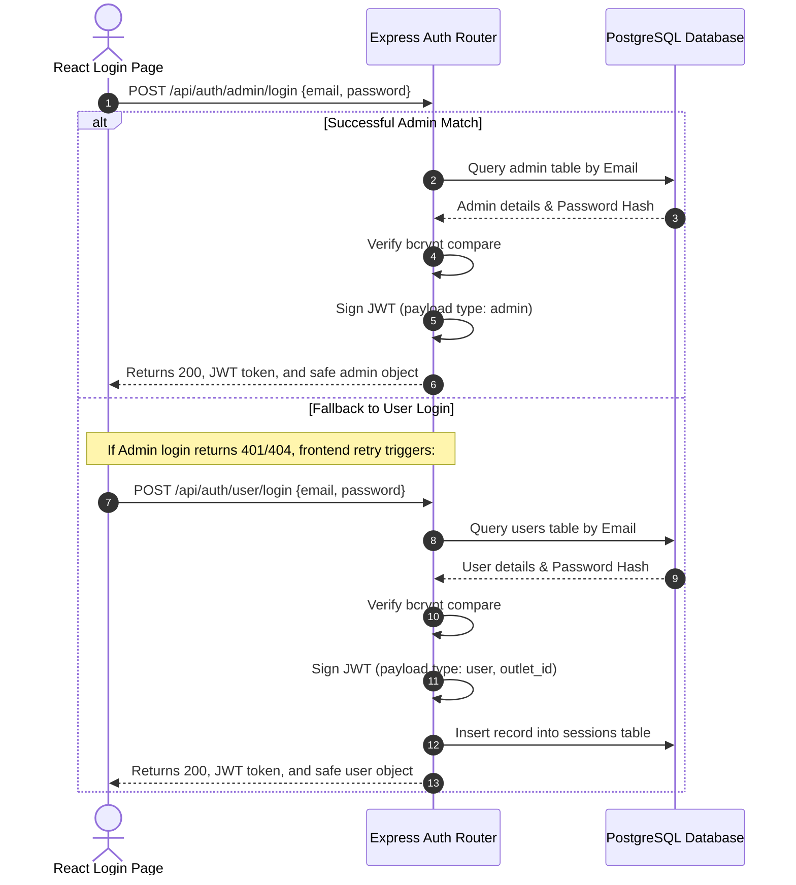
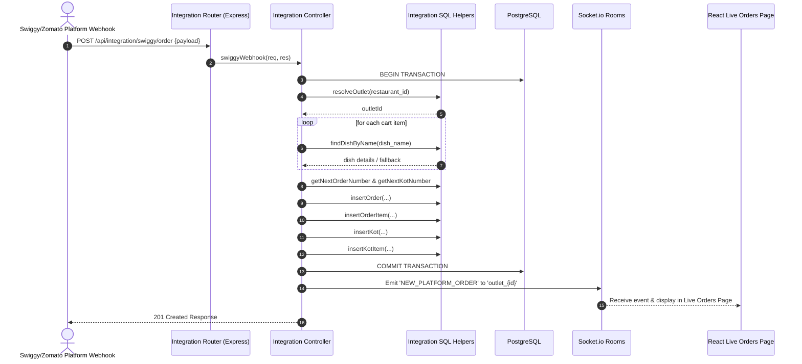
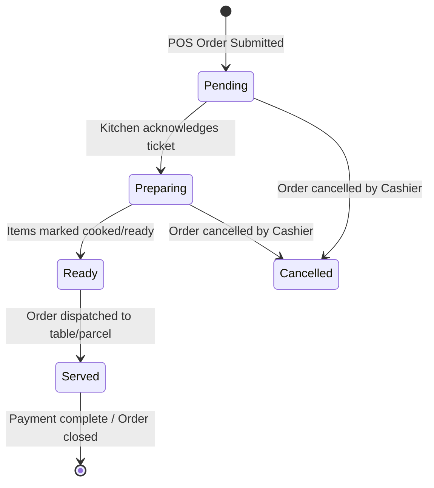

# GuptaSandwitch - Complete Project Architecture & Flow Context

This document provides a comprehensive overview of the **GuptaSandwitch** codebase, covering the project's folder structure, database schema, frontend & backend architecture, and request-response execution flows.

---

## 1. Project Folder Structure

Below is the directory structure of the **GuptaSandwitch** workspace:

```text
GuptaSandwitch/
├── Database/                         # DB Backup files (SQL Dumps)
│   ├── db_quenzy.sql                 # Primary PostgreSQL Database Dump (v18.3)
│   ├── shakaydita_27-05-26.sql       # Database snapshots & updates
│   ├── shakya_updated_database.sql   #
│   └── shakyadita_28-05-2026.sql     #
│
├── Documentaion/                     # Documentation files (DOCX, PDF, MD)
│   ├── Db_Structure.pdf              # PDF detailing the db schema
│   ├── ERdiagram.png                 # Image of the ERD
│   ├── GuptaSandwitch_Documentation.docx
│   ├── GuptaSandwitch_TechDocumentation.pdf
│   ├── PROJECT_DOCUMENTATION.md      # Detailed developer guide & API specifications
│   └── table_content_example.md      # Sample markdown content
│
├── backend/                          # Node.js + Express API Backend
│   ├── config/
│   │   └── database.js               # PostgreSQL connection pool using 'pg'
│   ├── middleware/
│   │   ├── authMiddleware.js         # JWT Verification, Role Guard & Permissions Checking
│   │   └── upload.js                 # Multer disk-storage image upload middleware
│   ├── routes/                       # Express Route Groups
│   │   ├── loginControllers/         # Auth controllers and SQL helper files
│   │   │   ├── authControllers.js    # Login/logout request handlers
│   │   │   ├── authRoutes.js         # /api/auth routes
│   │   │   └── authsqlc.js           # raw SQL helper methods for user/session queries
│   │   ├── outletControllers/        # Outlets & staff user management (Admin-only)
│   │   │   ├── outletcontroller.js   # Outlet CRUD handlers
│   │   │   ├── outletroutes.js       # /api/outlets routes
│   │   │   └── outletsqlc.js         # Outlet SQL helper methods
│   │   ├── POSControllers/           # POS, menu items, orders & KOT processing
│   │   │   ├── POScontroller.js      # POS logic & calculations
│   │   │   ├── POSroutes.js          # /api/pos routes
│   │   │   └── POSsqlc.js            # SQL queries for order placements and status changes
│   │   ├── dishesController/         # Menu dishes & categories management
│   │   │   ├── dishesController.js   # Dish CRUD handlers
│   │   │   ├── dishesRoutes.js       # /api/dishes routes
│   │   │   └── dishesSqlc.js         # Dishes SQL queries
<<<<<<< HEAD
│   │   └── OutletReportsControllers/ # Detailed reporting/analytics
│   │       ├── outletReportsController.js
│   │       ├── outletReportsRoutes.js# /api/reports routes
│   │       └── outletReportsSqlc.js  # Sales & analytics reports queries
=======
│   │   ├── OutletReportsControllers/ # Detailed reporting/analytics
│   │   │   ├── outletReportsController.js
│   │   │   ├── outletReportsRoutes.js# /api/reports routes
│   │   │   └── outletReportsSqlc.js  # Sales & analytics reports queries
│   │   └── integrationControllers/   # Swiggy & Zomato Online Platform webhook integrations
│   │       ├── integrationController.js # Handles third-party webhooks & commits orders/KOTs
│   │       ├── integrationcontrollersqlc.js # Raw SQL helpers for order ingestion
│   │       └── integrationRoutes.js  # /api/integration routes
>>>>>>> 45cf57865fb70e7d5f0e1bc08d9c279cf808ab62
│   ├── uploads/                      # Local uploaded dish images (static folder)
│   ├── utils/
│   │   └── dbqueryexecute.js         # General query execute helpers
│   ├── .env                          # Configuration (DB credentials, JWT secrets, etc.)
│   ├── .gitignore
<<<<<<< HEAD
│   ├── package.json                  # Dependencies: express, pg, helmet, compression, jwt, etc.
=======
│   ├── package.json                  # Dependencies: express, pg, helmet, compression, jwt, socket.io, etc.
│   ├── test_webhooks.js              # Script to test Swiggy and Zomato webhooks locally
>>>>>>> 45cf57865fb70e7d5f0e1bc08d9c279cf808ab62
│   └── server.js                     # Backend Entry point
│
├── frontend/                         # Vite + React Frontend
│   ├── public/                       # Static public assets
│   ├── src/
│   │   ├── components/               # Modular UI Components
│   │   │   ├── AdminSidebar/         # Navigation for Admin Panel
│   │   │   ├── AdminTopbar/          # Header for Admin Panel
│   │   │   ├── MenuPanel/            # Menu grids & filters for Staff POS
│   │   │   ├── OrderPanel/           # POS Cart & checkout panel
│   │   │   ├── PaymentModal/         # Invoice checkout modal
│   │   │   ├── ReceiptModal/         # KOT & Bill receipt popup
│   │   │   ├── Sidebar/              # Navigation for Staff Panel
│   │   │   ├── TablesPanel/          # Dine-in Table mapping & selector
│   │   │   ├── Toast/                # Custom alert toast UI
│   │   │   ├── TopBar/               # POS Dashboard stats header
│   │   │   └── assets/               # Image/Icon assets
│   │   ├── pages/                    # Container Layout Pages
│   │   │   ├── Admin/                # Admin Subpages (Dashboard, Dishes, Reports, Outlets, etc.)
│   │   │   ├── KOTPage/              # Kitchen Order Ticket display dashboard
│   │   │   ├── LiveOrdersPage/       # Online Platform orders (Swiggy/Zomato)
│   │   │   ├── LoginPage/            # Login Portal
│   │   │   ├── POSPage/              # Staff Point-Of-Sale page
│   │   │   └── ReportsPage/          # Staff reports page
│   │   ├── services/                 # Axios-based API client modules
│   │   │   ├── api.js                # Core Axios setup with Auth interceptors
│   │   │   ├── dishesApi.js          # API calls for dishes/categories
│   │   │   ├── loginApi.js           # API calls for Admin/User login
│   │   │   ├── outletApi.js          # API calls for Outlets/Staff users
│   │   │   ├── posApi.js             # API calls for POS menu, orders, and KOTs
│   │   │   └── reportapi.js          # API calls for sales reports and analytics
│   │   ├── utils/
│   │   │   └── printReceipt.js       # ESC/POS Receipt printer logic
│   │   ├── App.css                   # Global and container styling
│   │   ├── App.jsx                   # Central controller: auth routing and state initialization
│   │   ├── index.css                 # CSS variables and styling overrides
│   │   ├── index.jsx                 # React root mounting point
│   │   ├── vite.config.js            # Vite configurations
│   │   └── package.json              # React 19, Axios, Chart.js dependencies
│   ├── .env.example
│   └── README.md
│
├── categories_test.json              # Mock category configurations
<<<<<<< HEAD
├── dishes_test.json                  # Mock dishes configurations
├── lala.html                         # Scratch document
├── logo.jpeg                         # Branding logo
=======
│
├── dishes_test.json                  # Mock dishes configurations
│
├── lala.html                         # Scratch document
│
├── logo.jpeg                         # Branding logo
│
>>>>>>> 45cf57865fb70e7d5f0e1bc08d9c279cf808ab62
└── package-lock.json
```

---

## 2. Database Architecture (PostgreSQL Schema)

The system operates on PostgreSQL, utilizing constraints, enums, and database-level triggers to guarantee data integrity.

### 2.1 Custom Types & Enumerations
- `admin_role_enum`: `SUPER_ADMIN`, `ADMIN`
- `app_role_enum`: `Admin`, `Staff`
- `status_enum`: `active`, `inactive`
- `order_type_enum`: `dine` (Dine-In), `parcel` (Takeaway/Parcel), `swiggy`, `zomato`
- `order_status_enum`: `pending`, `preparing`, `ready`, `completed`, `cancelled`
- `payment_method_enum`: `cash`, `upi`, `card`, `wallet`, `online`
- `payment_status_enum`: `pending`, `paid`, `refunded`
- `kot_status_enum`: `pending`, `preparing`, `ready`, `served`, `cancelled`
- `transaction_type_enum`: `sale`, `refund`, `expense`, `purchase`
- `ledger_status_enum`: `paid`, `pending`, `due`, `overdue`
<<<<<<< HEAD

### 2.2 Key Table Entities
1. **`admin`**: Central control users. Contains UUIDs, password hashes, credentials, and permission JSON columns (`permissions jsonb`).
2. **`outlets`**: Outlet locations. Storing details like address, status, phone number, and outlet username/passwords.
3. **`users`**: Staff / outlet-specific users. Relates to a specific `outlet_id`. Stores their app roles (`Cashier`, `Manager`, etc.) and specific permissions.
4. **`categories`**: Menu classification entries.
5. **`dishes`**: MenuItem configuration mapping. Supports Veg/Non-Veg indicator, custom emojis, preparation times, and multi-tier pricing columns (e.g. `dine_price`, `parcel_price`, etc.). Note: The `outlets` column has been deleted from this table to enforce proper normalization.
6. **`dish_outlets`**: Junction table managing the relationships between dishes and outlets exclusively. Every time a dish is assigned to an outlet, a record is created here containing `dish_id` and `outlet_id`, allowing per-outlet pricing overrides and menu availability constraints. Do not store dish/outlet relations elsewhere.
7. **`ingredients` & `dish_ingredients`**: Track stocks, inventory units, and ingredient-menu recipes.
8. **`orders`**: Central sales log. Tracks totals, subtotals, packaging and delivery fees, GST tax, platform metadata, and current statuses.
9. **`order_items`**: Menu items within a specific order.
10. **`kots`**: Kitchen Order Tickets linked to orders. Tracks statuses and preparation details.
11. **`kot_items`**: Sub-items and quantities sent to kitchen staff screens.
12. **`accounting_ledger`**: Daily financial ledger record logging sales, refunds, expenses, and invoices.
13. **`sessions`**: Active staff sessions used to invalidate JWT tokens upon logout.
=======
- `discount_type_enum`: `percentage`, `fixed`
- `inventory_transaction_type_enum`: `purchase`, `usage`, `waste`, `adjustment`
- `notification_type_enum`: `order`, `kot`, `inventory`, `system`
- `user_role_enum`: `Manager`, `Cashier`, `Kitchen Staff`, `Custom`

### 2.2 Key Table Entities
1. **`admin`**: Central control users. Contains UUIDs, password hashes, credentials, and permission JSON columns (`permissions jsonb`).
2. **`outlets`**: Outlet locations. Stores details like address, status, phone number, and outlet username/passwords.
3. **`users`**: Staff / outlet-specific users. Relates to a specific `outlet_id`. Stores their app roles (`Cashier`, `Manager`, etc.) and specific permissions.
4. **`categories`**: Menu classification entries.
5. **`dishes`**: MenuItem configuration mapping. Supports Veg/Non-Veg indicator, custom emojis, preparation times, and multi-tier pricing columns (`dine_price`, `parcel_price`, `swiggy_price`, `zomato_price`). Note: The `outlets` column has been deleted from this table to enforce proper database normalization.
6. **`dish_outlets`**: Junction table managing the relationships between dishes and outlets exclusively. Stores availability status and pricing overrides per outlet.
7. **`ingredients` & `dish_ingredients`**: Track stocks, inventory units, and ingredient-menu recipes.
8. **`orders`**: Central sales log. Tracks totals, subtotals, packaging and delivery fees, GST tax, platform metadata, and current statuses.
9. **`order_items`**: Menu items within a specific order.
10. **`kot`**: Kitchen Order Tickets linked to orders. Tracks statuses and preparation details.
11. **`kot_items`**: Sub-items and quantities sent to kitchen staff screens.
12. **`accounting_ledger`**: Daily financial ledger record logging sales, refunds, expenses, and invoices.
13. **`sessions`**: Active staff sessions used to invalidate JWT tokens upon logout.
14. **`inventory_transactions`**: Record-keeping for inventory audits and usage deductions.
15. **`notifications`**: System notifications for orders, stock thresholds, and errors.
16. **`expenses`**: Logs miscellaneous outlet operating expenditures.
>>>>>>> 45cf57865fb70e7d5f0e1bc08d9c279cf808ab62

### 2.3 DB-Level Triggers & Procedures
- **`calculate_order_total()`**: Automatically aggregates subtotals, packaging, delivery, service charges, GST, and discounts to set the final order `total_amount` on insert or update.
- **`update_inventory_on_order_completion()`**: Runs upon order status changing to `completed`. It automatically deducts required quantities of ingredients from the `ingredients` stock table based on the recipe mapped in `dish_ingredients` (accounting for wastage percentages).
<<<<<<< HEAD
=======
- **`update_updated_at_column()`**: Helper trigger that updates `updated_at` timestamps on row updates.
>>>>>>> 45cf57865fb70e7d5f0e1bc08d9c279cf808ab62

---

## 3. System Architecture & Component Flow

The application splits responsibilities cleanly between the React UI, Axios communication layer, Express API Server, and SQL helper repositories:



### 3.1 Backend Layout
<<<<<<< HEAD
- **Routing Grouping**: Under `backend/routes/`, routes are split by logic domains. Express routing files mapping to controllers which orchestrate the requests.
=======
- **Routing Grouping**: Under `backend/routes/`, routes are split by logic domains. Express routing files map to controllers which orchestrate the requests.
>>>>>>> 45cf57865fb70e7d5f0e1bc08d9c279cf808ab62
- **Controller Layer (`*Controller.js`)**: Resolves requests, performs input validation, determines user context, and feeds sanitized arguments to the database querying layer.
- **SQL Execution Layer (`*sqlc.js` & `dbqueryexecute.js`)**: Houses raw SQL queries executing parameterized commands against the database connection pool (`pg.Pool`). This isolates database logic from Express web controllers.
- **Security Check (`authMiddleware.js`)**: 
  - `protect(modelType)`: Verifies client authorization bearer tokens using `jsonwebtoken`. Validates if the user's account status remains `active`.
  - `restrictTo(...roles)`: Verifies if the authenticated actor possesses appropriate privileges.
  - `checkPermission(resource, action)`: Granular JSON permission mapping checks.
<<<<<<< HEAD
=======
- **Third-Party Integration**: Implements webhooks for Swiggy and Zomato inside `integrationControllers`. Ingests platform payloads, maps items to dishes (falling back to default items if unnamed), starts transactions, creates orders/KOTs, and emits real-time WebSocket updates.
>>>>>>> 45cf57865fb70e7d5f0e1bc08d9c279cf808ab62

### 3.2 Frontend Layout
- **State Initialization & Persist (`App.jsx`)**: Upon start, reads tokens, user details, and auth roles from both `sessionStorage` and `localStorage`. Updates `currentUser` states and controls panel displays based on the user category (`admin` vs. `user`/`staff`).
- **Axios Interceptors (`frontend/src/services/api.js`)**: 
  - **Request Interceptor**: Dynamically adds `Authorization: Bearer <JWT>` header to all outgoing requests.
<<<<<<< HEAD
  - **Response Interceptor**: Intercepts `401 Unauthorized` errors. Triggers automated local storage clear-outs and forces a redirect to the login portal.
- **Differentiated Portals**:
  - **Admin View**: Sidebar navigation accessing outlets setup, dish menus, accounts ledgers, and comprehensive outlet reports.
=======
  - **Response Interceptor**: Intercepts `401 Unauthorized` errors, triggers automated local storage clear-outs, and forces a redirect to the login portal.
- **Socket.io Integration**: 
  - Frontend client emits a `join_outlet` event upon authentication to join a designated Socket.io room (`outlet_<outletId>`).
  - Listens to incoming socket events such as `NEW_PLATFORM_ORDER` to dynamically append Swiggy/Zomato orders and play audible notifications.
- **Differentiated Portals**:
  - **Admin View**: Sidebar navigation accessing outlets setup, dish menus, accounts ledgers, and comprehensive analytics reports.
>>>>>>> 45cf57865fb70e7d5f0e1bc08d9c279cf808ab62
  - **Staff View**: Interactive Point of Sale menu grid, table assignments, kitchen ticket (KOT) trackers, platform integrations, and local sales reports.

---

## 4. Key Execution Flows

### 4.1 Authentication Flow (Admin vs. User Login)



### 4.2 Order Submission & Checkout Flow (POS Page)
<<<<<<< HEAD

1. **Item Selection & Cart Setup**: POS client interface adds dishes to the cart. Selected options determine dynamic pricing depending on selected `orderType` (dine-in, parcel, swiggy, zomato).
=======
1. **Item Selection & Cart Setup**: POS client interface adds dishes to the cart. Selected options determine dynamic pricing depending on selected `orderType` (`dine`, `parcel`, `swiggy`, `zomato`).
>>>>>>> 45cf57865fb70e7d5f0e1bc08d9c279cf808ab62
2. **Checkout Invocation**: Cashier selects payment method (Cash / UPI / Card) and clicks confirm.
3. **Frontend Payload Processing (`posApi.js`)**: Client formats payloads mapping dishes to ids, quantities, applying flat/percentage discounts, and attaching the current `outlet_id`.
4. **Backend Processing (`POScontroller.js`)**:
   - Begins a database transaction.
   - Computes tax, subtotal, and total amount.
   - Inserts order details into `orders`.
   - Inserts order item listings in `order_items`.
<<<<<<< HEAD
   - Inserts a corresponding Kitchen Order Ticket record in `kots`.
=======
   - Inserts a corresponding Kitchen Order Ticket record in `kot`.
>>>>>>> 45cf57865fb70e7d5f0e1bc08d9c279cf808ab62
   - Inserts KOT item listings in `kot_items`.
   - Commits transaction and returns the confirmation payload.
5. **Kitchen Notification**: Live KOT screens fetch new tickets or trigger WebSocket alerts.
6. **Receipt Rendering**: Triggers `printReceipt.js` to dispatch ESC/POS command strings to thermal printing utilities.

<<<<<<< HEAD
### 4.3 Kitchen Order Ticket (KOT) Life Cycle
=======
### 4.3 Swiggy / Zomato Order Webhook Ingestion Flow



### 4.4 Kitchen Order Ticket (KOT) Life Cycle
>>>>>>> 45cf57865fb70e7d5f0e1bc08d9c279cf808ab62



- **Partial Preparation**: Kitchen displays (`KOTPage.jsx`) allow clicking individual items to toggle preparation state (`markItemReady`).
- **Complete Ticket**: When all items are ready, the status updates to `ready`, enabling dispatching options.
- **Dispatching**: Marking KOT as dispatched updates status to `served` / `completed`, triggering inventory deductions via triggers.

---

## 5. Summary of API Controller Responsibilities

<<<<<<< HEAD
| Domain Router | Controller Endpoint | HTTP Method | Guarded Roles | Purpose |
| :--- | :--- | :---: | :---: | :--- |
| **Auth** | `/api/auth/admin/login` | `POST` | Public | Authenticate corporate manager / super admins |
| | `/api/auth/user/login` | `POST` | Public | Authenticate cashiers & kitchen staff |
| | `/api/auth/me` | `GET` | Active JWT | Check authentication session status |
| **Outlets** | `/api/outlets` | `GET` | Admin | Retrieve all restaurant outlet details |
| | `/api/outlets/add-outlet`| `POST` | Super Admin | Provision a new outlet store |
| | `/api/outlets/:id/users` | `POST` | Admin | Add a new Cashier / Manager to an outlet |
| **POS** | `/api/pos/dishes/available`| `GET` | Staff / Admin| Fetch menu items based on outlet and order type |
| | `/api/pos/orders` | `POST` | Cashier | Submit new orders & instantiate KOTs |
| | `/api/pos/kots` | `GET` | Kitchen / Staff| List all live preparation tickets |
| | `/api/pos/kots/:kotId/ready`| `PATCH`| Kitchen | Mark entire ticket items prepared |
| **Dishes** | `/api/dishes` | `POST` | Admin | Create dishes and save menu upload images |
| | `/api/dishes/:id` | `PUT` | Admin | Edit pricing details, veg settings, or status |
| **Reports** | `/api/reports/summary` | `GET` | Admin / Staff | Aggregated sales totals, payment distributions |
| | `/api/reports/top-items` | `GET` | Admin | Find top-selling menu items by volume and revenue |
=======
| Domain Router | Controller Endpoint | HTTP Method | Guarded Roles / Permissions | Purpose |
| :--- | :--- | :---: | :---: | :--- |
| **Auth** | `/api/auth/admin/login` | `POST` | Public | Authenticate corporate manager / super admins |
| | `/api/auth/user/login` | `POST` | `POST` | Public | Authenticate cashiers & kitchen staff |
| | `/api/auth/me` | `GET` | Active JWT | Check authentication session status |
| | `/api/auth/logout` | `POST` | Active JWT | Terminate active staff user session |
| **Outlets** | `/api/outlets` | `GET` | Admin | Retrieve all restaurant outlet details |
| | `/api/outlets/dashboard/stats` | `GET` | Admin | Fetch stats for the admin dashboard |
| | `/api/outlets/add-outlet` | `POST` | Super Admin | Provision a new outlet store |
| | `/api/outlets/:id` | `PUT` | Admin | Update outlet manager, address, name, etc. |
| | `/api/outlets/:id/credentials` | `PUT` | Admin | Update username or password credentials |
| | `/api/outlets/:id/status` | `PUT` | Admin | Toggle outlet active/inactive status |
| | `/api/outlets/:id/users` | `POST` | Admin | Add a new Cashier / Manager to an outlet |
| | `/api/outlets/:id/users/:userId` | `PUT` | Admin | Update outlet user details or permissions |
| | `/api/outlets/:id/users/:userId/status` | `PUT` | Admin | Toggle outlet user active/inactive status |
| | `/api/outlets/:id/users/:userId` | `DELETE` | Admin | Remove staff user from outlet |
| **POS** | `/api/pos/categories` | `GET` | Staff / Admin | Fetch all menu categories |
| | `/api/pos/dishes` | `GET` | Staff / Admin | Fetch all dishes |
| | `/api/pos/dishes/available` | `GET` | Staff / Admin | Fetch menu items based on outlet and order type |
| | `/api/pos/dishes/search` | `GET` | Staff / Admin | Search dishes by keyword |
| | `/api/pos/categories/:categoryId/dishes` | `GET` | Staff / Admin | Fetch dishes under a specific category |
| | `/api/pos/orders` | `POST` | Cashier | Submit new orders & instantiate KOTs |
| | `/api/pos/orders/:orderId` | `GET` | Staff / Admin | Get order details by ID |
| | `/api/pos/orders/:orderId/cancel` | `POST` | Cashier | Cancel an order |
| | `/api/pos/kots` | `GET` | Kitchen / Staff | List all live preparation tickets |
| | `/api/pos/kots/pending` | `GET` | Kitchen / Staff | Fetch pending KOT tickets |
| | `/api/pos/kots/ready` | `GET` | Kitchen / Staff | Fetch ready KOT tickets |
| | `/api/pos/kots/:kotId/items/:itemId/ready` | `PATCH` | Kitchen | Toggle individual item ready status |
| | `/api/pos/kots/:kotId/ready` | `PATCH` | Kitchen | Mark entire ticket items prepared |
| | `/api/pos/kots/:kotId/dispatch` | `POST` | Kitchen | Dispatch prepared order (mark served/completed) |
| | `/api/pos/kots/:kotId/status` | `PATCH` | Kitchen | Update KOT status manually |
| | `/api/pos/dashboard/stats` | `GET` | Staff / Admin | Cashier dashboard stats |
| **Dishes** | `/api/dishes` | `GET` | Staff / Admin | Fetch all dishes for menu manager |
| | `/api/dishes/categories` | `GET` | Staff / Admin | Fetch categories list |
| | `/api/dishes` | `POST` | Admin | Create dishes and save menu upload images |
| | `/api/dishes/:id` | `PUT` | Admin | Edit pricing details, category, name, or image |
| | `/api/dishes/:id` | `DELETE` | Admin | Delete a dish and clear relationship links |
| **Integration**| `/api/integration/swiggy/order` | `POST` | Public Webhook | Webhook for Swiggy online order integration |
| | `/api/integration/zomato/order` | `POST` | Public Webhook | Webhook for Zomato online order integration |
| **Reports** | `/api/reports/summary` | `GET` | Admin / Staff | Aggregated sales totals, payment distributions |
| | `/api/reports/order-analytics` | `GET` | Admin | Order volume and timing analytics |
| | `/api/reports/order-types` | `GET` | Admin | Distribution of order types (dine, parcel, swiggy, zomato) |
| | `/api/reports/payment-analytics` | `GET` | Admin | Distribution of payment methods (cash, upi, card, etc.) |
| | `/api/reports/hourly-sales` | `GET` | Admin | Hourly sales and volume distribution |
| | `/api/reports/category-sales` | `GET` | Admin | Sales aggregated by category |
| | `/api/reports/top-items` | `GET` | Admin | Find top-selling menu items by volume and revenue |
| | `/api/reports/kot-analytics` | `GET` | Admin | Average preparation and dispatch times |
| | `/api/reports/table-analytics` | `GET` | Admin | Dining table occupancy and revenue stats |
| | `/api/reports/customer-analytics` | `GET` | Admin | CRM analytics (customer visits, spending) |
| | `/api/reports/recent-orders` | `GET` | Admin | Recent sales log feed |
>>>>>>> 45cf57865fb70e7d5f0e1bc08d9c279cf808ab62

---

## 6. POS & KOT Controller Error Resolutions & Query Logic

### 6.1 Database Schema Normalization (Outlets Column Deletion)
<<<<<<< HEAD
The JSONB `outlets` column in the `dishes` table has been removed. Relationships between dishes and outlets are now handled exclusively through the `dish_outlets` junction table.
=======
The JSONB `outlets` column in the `dishes` table has been removed in the final database normalization layout. Relationships between dishes and outlets are now handled exclusively through the `dish_outlets` junction table.
>>>>>>> 45cf57865fb70e7d5f0e1bc08d9c279cf808ab62

### 6.2 Backend SQL Query Scoping (`POSsqlc.js`)
- **`getAllDishes`**: Updated to join directly with `dish_outlets` when an `outletId` is provided (using `INNER JOIN dish_outlets`). This restricts menu dishes fetched by the POS Page to only those assigned to the logged-in outlet, removing the old query dependencies on `d.outlets`.
- **`getDishesByIds`**: Updated similarly to use `INNER JOIN dish_outlets` when an `outletId` is provided, verifying dish availability on checkout for that specific outlet.

### 6.3 Helper Safeguards & Optional Chaining (`POScontroller.js`)
The helper function `parseOutletId` was updated with optional chaining (`req.query?.outletId || req.body?.outletId || req.headers?.['x-outlet-id']`). This prevents runtime TypeErrors when accessing query, body, or header properties for requests that don't pass these payloads.

### 6.4 Global Error Handler Middleware (`server.js`)
The global error handler was modified to check `err.statusCode || err.status` before defaulting to `500`. This allows custom validation and status transition errors (like `400 Bad Request`, `403 Forbidden`, and `404 Not Found`) to return their proper HTTP status codes.

### 6.5 Dynamic Session Scoping
- **Frontend Session Persistency**: Upon login (`loginUser`), the backend returns the staff user's `outlet_id`. The React client (`App.jsx`) saves this dynamically in `sessionStorage` under `gs_outlet_id`.
- **POS / KOT API Scope**: All client API requests dynamically fetch the `outletId` using the helper `getDefaultOutletId()`, passing it as a query/request parameter to ensure proper scoping for all POS, KOT, and Reports pages.
